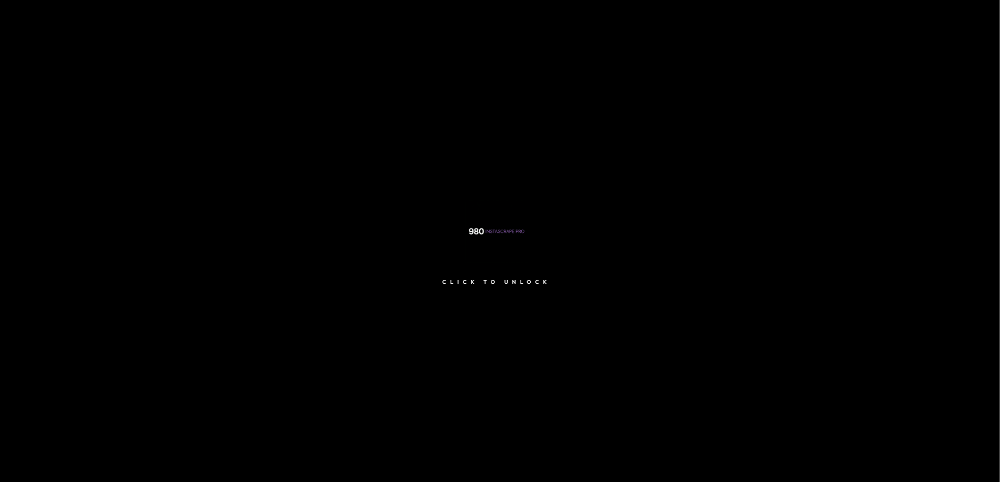
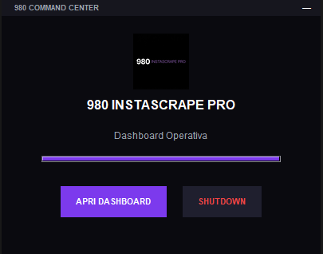
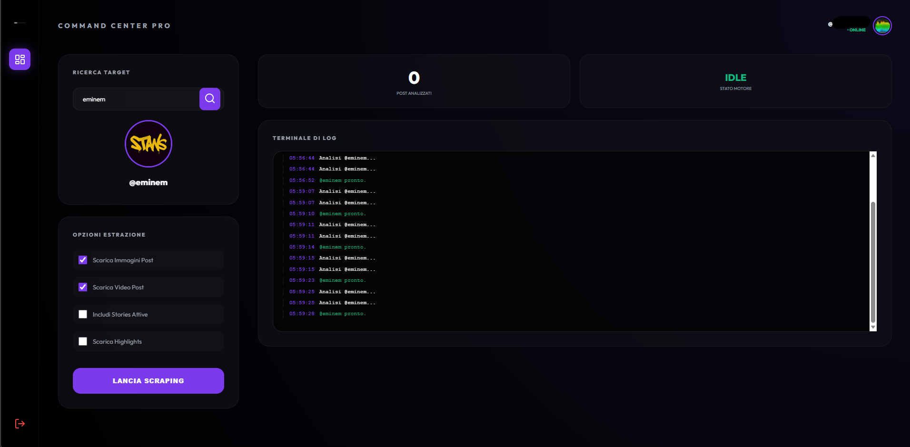

# ⚡ 980 INSTASCRAPE PRO ⚡


> **ENG**: An elite, monolithic scraping infrastructure designed for speed and stealth.  
> **ITA**: Un'infrastruttura di scraping d'élite, progettata per velocità e discrezione.

---

## 🇺🇸 English Presentation

**980 InstaScrape Pro** is a high-end scraping ecosystem. It's not just a script: it's a monolithic portable application that fuses the raw power of [Instaloader](https://github.com/instaloader/instaloader) with a real-time interactive Dashboard and a custom Desktop Command Center.

### 🛠️ Core Features
*   **Shadow-Bypass Technology**: Advanced dynamic headers and session management to bypass "Login Required" and CDN restrictions.
*   **Mobile API v1 Emulation**: Optimized endpoints for high-success rate requests.
*   **Glass Clean Aesthetic**: Ultra-minimalist UI with real-time logs and authenticated image proxying.
*   **Portable & Volatile**: A single executable that leaves zero traces on the system.
*   **Control Center GUI**: A custom desktop window with a progress bar and master shutdown controls.

### 🚀 Build & Run
Compile your own standalone EXE with one click:
```powershell
.\COMPILA_980.bat
```

---

## 🇮🇹 Presentazione Italiana

**980 InstaScrape Pro** è un'infrastruttura di scraping d'élite. Non è un semplice script: è un'applicazione monolitica portatile che fonde la potenza di [Instaloader](https://github.com/instaloader/instaloader) con una Dashboard interattiva in tempo reale e un Command Center desktop personalizzato.

### 🛠️ Punti di Forza
*   **Shadow-Bypass Technology**: Gestione avanzata di header e sessioni per superare i blocchi "Login Required" e le restrizioni CDN.
*   **Mobile API v1 Emulation**: Endpoint ottimizzati per garantire il massimo tasso di successo nelle analisi.
*   **Estetica Glass Clean**: Interfaccia UI ultra-minimalista con log in tempo reale e proxy per immagini autenticate.
*   **Portable & Volatile**: Un unico eseguibile che non lascia tracce sul sistema ospite.
*   **Control Center GUI**: Una finestra desktop dedicata con barra di progresso e tasti di spegnimento rapido.

### 🚀 Deploy
Compila il tuo eseguibile standalone con un click:
```powershell
.\COMPILA_980.bat
```

---

## ⚖️ Disclaimer / Avvertenze
This tool is for research and data analysis purposes only. The author is not responsible for any misuse. Respect platform TOS and privacy laws.  
*Questo strumento è per soli scopi di ricerca e analisi. L'autore non è responsabile per usi impropri. Rispetta i termini di servizio e le leggi sulla privacy.*

---

## 📸 Screenshots

### 🔒 Lock Screen


### 🎛️ Control Center GUI


### 📊 Dashboard


---
*Developed with 💜 for the GitHub Community.*
